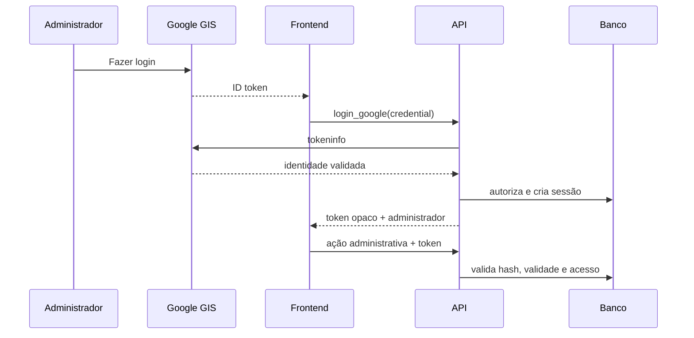

# Contratos da API

## Transporte

Exceção: salas auxiliares possuem endpoint independente `api/placar.php`,
exclusivo do PHP/MySQL, sem autenticação administrativa. Contrato completo em
[Placar compartilhado](PLACAR_COMPARTILHADO.md#etapa-2--api-exclusiva-do-mysql).
Esse endpoint exige `application/json` nos POSTs; não usa o transporte de QAS
descrito abaixo. Implementado no código, ainda aguardando validação no servidor.

- Endpoint PHP: `/sinuca-aec/api/`.
- GET: ação e parâmetros na query string.
- POST: JSON enviado como `text/plain;charset=utf-8` para evitar preflight em
  certos cenários do Apps Script; a API decodifica normalmente.
- Sucesso: JSON específico da ação.
- Erro: `{ "erro": "mensagem" }` e status HTTP correspondente no PHP.
- Apps Script pode responder HTTP 200 mesmo em alguns erros de aplicação; o
  frontend verifica a propriedade `erro`.

## Autenticação

As ações administrativas recebem `token`. O login recebe a credencial Google,
valida audience, issuer, validade e e-mail e devolve sessão opaca. O navegador
persiste a sessão no `localStorage`; o banco armazena somente o hash do token.

## Ações públicas (GET)

| Ação | Parâmetros | Finalidade |
|---|---|---|
| `status` | — | Saúde, versão e backend |
| `temporadas` | — | Atual, anos públicos e taxa atual |
| `rodadas` | `serie`, `temporada?` | Rodadas e match-cards |
| `estatisticas` | `serie`, `temporada?` | Classificação, jogadores e resultados |
| `ranking` | — | Ranking geral e janela de cinco anos |

Sem `temporada`, rodadas/estatísticas usam a atual. Somente `ATIVA` e
`ARQUIVADA` são públicas.

### Estruturas públicas importantes

`rodadas` retorna uma lista com `rodada`, `data`, `hora`, `status`, contadores,
`folga?` e `partidas`. Cada partida possui jogadores completos, placares em
string (`-` quando vazio), observação, status descritivo e ID estável composto.

`estatisticas` retorna `temporada`, `divisao`, `total_rodadas`,
`total_participantes`, `jogadores` em ordem numérica e `classificacao` ordenada.

`ranking` retorna `referencia`, `periodo`, `ranking` (máximo 30) e `detalhes`.

## Ações administrativas (POST)

| Ação | Campos além de `token` | Finalidade |
|---|---|---|
| `login_google` | `credential` (sem `token`) | Autenticar administrador |
| `validar_sessao` | — | Restaurar sessão |
| `logout` | — | Revogar sessão |
| `admin_partidas` | `divisao` | Editar partidas atuais |
| `admin_participantes` | `divisao` | Editar vínculos atuais |
| `admin_jogadores` | — | Listar todos os jogadores |
| `admin_temporadas` | — | Gestão de anos e configurações |
| `admin_dados_planilha` | `temporada`, `divisao` | Dataset completo para XLSX |
| `admin_regulamento` | `temporada` | DOCX em base64 |
| `salvar_taxa_inscricao` | `temporada`, `taxa` | Taxa anual |
| `salvar_referencia_ranking` | `temporada` | Referência da janela |
| `preparar_temporada` | `temporada` | Sugestão de nova temporada |
| `preparar_temporada_legada` | `temporada` | Editor histórico vazio |
| `carregar_temporada` | `temporada` | Abrir rascunho/atual/legada |
| `salvar_temporada` | `temporada`, `participantes`, `rodadas` | Rascunho novo |
| `salvar_temporada_atual` | `participantes`, `rodadas` | Editar atual |
| `salvar_temporada_legada` | `temporada`, `participantes`, `rodadas` | Criar/editar histórica |
| `publicar_temporada_legada` | `temporada` | PREPARACAO → ARQUIVADA |
| `ativar_temporada` | `temporada` | Arquivar atual e ativar a próxima |
| `excluir_temporada` | `temporada` | Excluir somente rascunho |
| `salvar_participantes` | `divisao`, `participantes`, `ativar_jogadores` | Lote de participantes |
| `salvar_jogadores` | `jogadores` | Lote de cadastros |
| `salvar_partida` | dados da partida | Compatibilidade/gravação unitária |
| `salvar_partidas` | `partidas` | Gravação em lote |
| `salvar_data_rodada` | `divisao`, `rodada`, `data` | Data unitária |
| `salvar_datas_rodadas` | `rodadas` | Datas em lote |

### Payload de partida

Campos usados: `divisao`, `rodada`, `numero1`, `numero2`, `data`, `hora`,
`status`, `placar1`, `placar2`, `observacao`, `versao`, e indicadores de W.O.
quando selecionados pela interface. O backend deve rejeitar confronto inexistente,
status/placar inconsistente e versão desatualizada.

### Payload de temporada

`participantes` é `{ A: [...], B: [...] }`, com `jogador_id` e metadados de
desempate/W.O. `rodadas` tem a mesma divisão por chave; cada rodada contém
`rodada`, `folga`, agenda e `partidas` com números, agenda, status, placares e
observação.

## Cache e compatibilidade

Salas auxiliares (`api/placar.php`) não usam o cache do campeonato: códigos
novos de seis números (`000001`–`999999`), senha de quatro números e reutilização
atômica de códigos expirados. PIN/código são strings para preservar zeros.
Desfazer envia uma atualização normal versionada, com o estado anterior.
Contrato e limites detalhados em `PLACAR_COMPARTILHADO.md`.

Leituras públicas têm cache em memória de 60 segundos. Escritas limpam o cache.
`salvar_partidas` tenta lote e mantém fallback para várias chamadas
`salvar_partida` por compatibilidade com implantações antigas do QAS.

## Paridade atual

PHP/MySQL continua sendo a referência de produção. O Apps Script implementa o
mesmo conjunto de ações públicas e administrativas usado pelo frontend:
temporadas, rodadas, estatísticas, ranking, autenticação, CRUD administrativo,
edição da temporada vigente, rascunhos novos/históricos, publicação, ativação,
configurações, exportação XLSX e regulamento DOCX. A ação pública adicional
`jogadores` permanece apenas no Apps Script por compatibilidade histórica.

Paridade aqui significa contrato e regra funcional. A troca de temporada no PHP
é uma transação ACID; no Google Sheets ela usa `ScriptLock` e compensações, pois
o serviço não oferece transação multiaba. Ao criar uma ação:

1. decidir explicitamente se será exclusiva do PHP ou duplicada;
2. atualizar `js/api.js`;
3. atualizar `api/index.php` e/ou `appsscript/Code.gs`;
4. documentar a matriz de compatibilidade.

### Ativação de temporada

`ativar_temporada` existe nos dois backends. No PHP, bloqueia as temporadas
atual e futura, valida rascunho, participantes e agenda, arquiva a atual, ativa a
nova, atualiza `settings.temporada_atual`, sincroniza jogadores, audita e
incrementa `data_versions` dentro de uma única transação.
