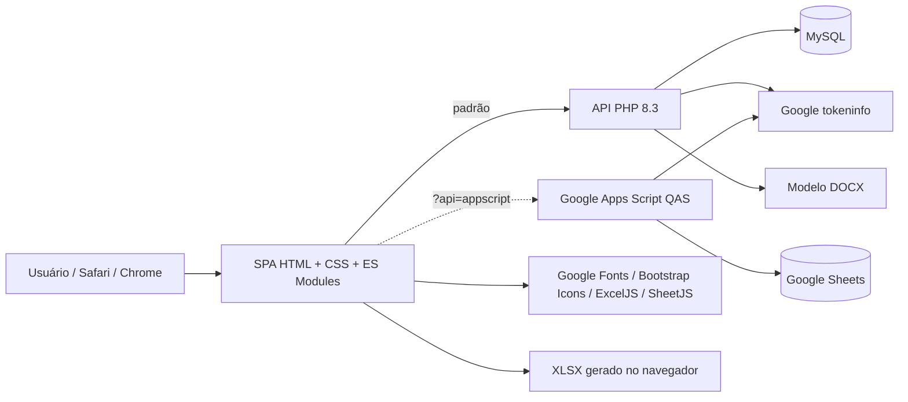
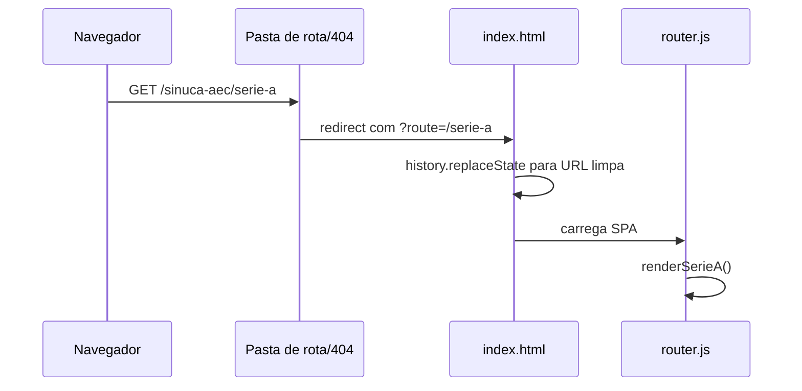

# Arquitetura

## Visão de componentes



## Frontend

Não há framework, bundler ou gerenciador de pacotes. `index.html` carrega
`js/app.js` como módulo. `js/router.js` escolhe a página pelo pathname.

### Camadas

- `js/pages/`: composição de páginas e orquestração de dados.
- `js/components/`: HTML reutilizável de navbar, tabs, filtros, cards e tabelas.
- `js/utils/`: datas, scroll, filtros e geração de XLSX.
- `js/api.js`: seleção do backend, cache e contrato HTTP.
- `js/auth.js`: persistência e restauração da sessão administrativa.
- `css/`: tokens, layout, componentes e página inicial.
- `manifest.webmanifest`: metadados de instalação da PWA.
- `service-worker.js`: instalação, atualização e fallback do casco estático.

O login Google usa callback popup nos navegadores comuns. No PWA standalone do
iPhone, usa redirect para `api/google-login-redirect.php`; o endpoint valida o
CSRF enviado pelo Google, reutiliza `AuthService`, grava a sessão no storage da
origem e retorna à rota administrativa sem colocar o token na URL.

No ranking e nos cards de Classificação e Resultados das séries e do histórico,
a tabela permanece como a única região de rolagem horizontal. Uma indicação
externa a essa região, mas dentro do card, orienta o gesto lateral sem acompanhar
o deslocamento da tabela. Ela é sempre visível em Resultados, aparece na
Classificação até 388 px e, no Ranking, somente em touch até 907 px.
Em dispositivos com mouse, as três tabelas também aceitam clicar, segurar e
arrastar horizontalmente, com cursores `grab`/`grabbing`; toque, trackpad e a
barra de rolagem permanecem disponíveis como alternativas nativas.

Os filtros de rodada, jogador e pendência são aplicados no cliente sobre os
cards já carregados. Nas séries, o status vem de `data-status`; no painel
administrativo, a pendência considera `data-original-status`, isto é, o estado
persistido, para que uma edição ainda não salva não desapareça da tela.

Todas as rotas, exceto a Home, recebem um botão flutuante reutilizável para
retorno suave ao topo. O componente é criado uma única vez por `js/app.js` e
sincronizado após cada renderização de rota.

## Mapa do repositório

```text
/
├── index.html, 404.html, .htaccess, manifest.webmanifest, service-worker.js
├── administrador/, serie-a/, serie-b/, regra/, historico/, ranking/, placar/
│   └── index.html              # entradas das rotas amigáveis
├── js/
│   ├── app.js, router.js, config.js, api.js, auth.js
│   ├── pages/                  # controladores/renderização por página
│   ├── components/             # cards, tabelas, navbar, tabs e filtros
│   └── utils/                  # scroll, datas, filtros e XLSX
├── css/                        # variáveis, base, layout, componentes e Home
├── assets/
│   ├── content/                # HTML da regra e regulamento
│   ├── images/                 # imagens do site e planilhas
│   └── templates/              # XLSX de importação
├── api/
│   ├── index.php               # front controller
│   ├── config.example.php      # exemplo sem segredos
│   ├── src/                    # serviços e domínio PHP
│   └── templates/              # modelo DOCX obrigatório
├── database/migrations/        # schema consolidado e upgrades históricos
├── appsscript/                 # backend alternativo de QAS
├── docs/                       # documentação viva
└── AGENTS.md                   # regras para futuras IAs
```

### Apps Script por arquivo

- `Code.gs`: roteamento HTTP.
- `config.gs`: IDs, cliente Google, duração e nomes das abas.
- `auth.gs`: Google, sessão e autorização.
- `jogadores.gs`: cadastro de jogadores.
- `participantes.gs`: vínculos da temporada atual.
- `rodadas.gs`: partidas, datas, status e placares.
- `temporadas.gs`: rascunhos, histórico, chaveamento e ativação.
- `estatisticas.gs`: classificação/ranking compatíveis com o QAS.
- `paridade_api.gs`: configurações, ranking, exportação, regulamento, edição
  vigente/histórica e auxiliares que espelham contratos do PHP.
- `utils.gs`: Sheets, cache e utilidades.

### Navegação



`navigate()` preserva a query string (inclusive seleção de backend), redefine o
scroll e força navegação de documento ao sair da Home para evitar herança de
scroll em navegadores móveis.

### Placar de mesa

`/placar` é uma rota funcional deliberadamente ausente dos menus. O módulo
`js/pages/placar.js` adapta o marcador do projeto legado RegraBrasileira ao
design e à infraestrutura desta SPA. Pontos, nomes, vitórias e histórico das
partidas ficam exclusivamente no `localStorage` do dispositivo, sob a chave
`aec_sinuca_placar`; a tela não consulta nem escreve na API. Bolas, mapa da mesa,
logos e ícones próprios usam SVGs do projeto atual. A rota `/regra` concentra o
conteúdo normativo, evitando sua duplicação dentro do marcador.

Enquanto o marcador permanece visível, o módulo solicita um bloqueio de tela
pela Screen Wake Lock API. O bloqueio é solicitado novamente quando o documento
volta ao primeiro plano e liberado ao navegar para outra rota. A indisponibilidade
ou recusa do navegador é tratada silenciosamente e não impede o uso do placar.

## API PHP

`api/index.php` é um front controller:

1. lê `api/config.local.php` ou caminho em `AEC_SINUCA_CONFIG`;
2. abre PDO por `Database`;
3. instancia `PublicService`, `AuthService` e `AdminService`;
4. seleciona a ação por `acao`;
5. responde JSON por `JsonResponse`.

### Responsabilidades

- `PublicService`: temporadas, rodadas, estatísticas e ranking.
- `StatisticsCalculator`: cálculo puro de classificação e resultados.
- `AuthService`: login Google, autorização, sessões e logout.
- `GoogleTokenVerifier`: valida ID token no Google.
- `AdminService`: comandos administrativos, transações, validação e auditoria.
- `RegulationDocumentGenerator`: altera XML interno do modelo DOCX.

Escritas sensíveis usam transações e registram `audit_log`. O escopo global em
`data_versions` é incrementado após mutações, embora o frontend atual ainda use
cache local por tempo, não polling explícito dessa versão.

## Seleção de backend

Em `js/api.js`:

- sem parâmetro: PHP/MySQL;
- `?api=mysql`: também PHP/MySQL, por comportamento padrão;
- `?api=appscript` ou `?api=apps-script`: Apps Script.

O parâmetro acompanha a navegação interna. O Apps Script é o ambiente alternativo
de QAS e mantém paridade de contrato com as ações consumidas pelo frontend.
Persistência e garantias operacionais continuam diferentes: MySQL usa transações
ACID; Sheets usa bloqueio de script e operações coordenadas entre abas.

## Cache

- HTML/CSS/JS: `.htaccess` força revalidação para evitar versões antigas.
- Imagens/fontes: cache de 30 dias.
- Dados GET do frontend: `Map` em memória com TTL de 60 segundos.
- Toda mutação via funções públicas de `js/api.js` limpa o cache em memória.
- PWA: o service worker usa rede primeiro para recursos da mesma origem e só
  recorre ao cache estático quando a rede falha. Requisições em `api/`, métodos
  diferentes de GET e origens externas não são interceptados.

## PWA instalável

O frontend é instalável como Progressive Web App. O manifesto usa caminhos
relativos para funcionar tanto em localhost quanto sob `/sinuca-aec/`, inicia
na Home e abre em modo `standalone`. Não existe convite de instalação criado
pelo frontend: Chrome/Android decide quando mostrar sua promoção nativa; no
iPhone o usuário utiliza “Adicionar à Tela de Início” no menu do navegador.

Os ícones ficam em `assets/icons/`: 192 e 512 px comuns, 192 e 512 px com área
segura `maskable`, além de `apple-touch-icon.png` com 180 px. Todos usam fundo
branco e o escudo oficial centralizado.

## Geração de arquivos

### XLSX

Executada no cliente com ExcelJS. A API fornece dados consolidados; o navegador
monta folhas, estilos, imagens, margens e áreas de impressão e baixa um `.xlsx`.

### Importação XLSX

Executada no cliente com SheetJS. Participantes e partidas são normalizados,
validados e carregados no editor antes de persistir.

### DOCX

Executada no backend selecionado. PHP usa ZIP + DOM; o Apps Script usa
`Utilities.unzip/zip` e substituições controladas nos mesmos `document.xml` e
`numbering.xml`. Ambos preservam mídia/estilos e retornam base64 em JSON.

## Restrições arquiteturais

- A aplicação depende de JavaScript e de CDNs no primeiro uso das bibliotecas.
- Não há build que detecte automaticamente imports ou CSS mortos.
- Não há ORM; SQL está nos services.
- PHP e Apps Script duplicam regras; toda mudança de contrato/regra deve ser
  aplicada e testada nos dois para preservar a paridade.
- A hospedagem compartilhada favorece PHP/MySQL e requisições curtas.
