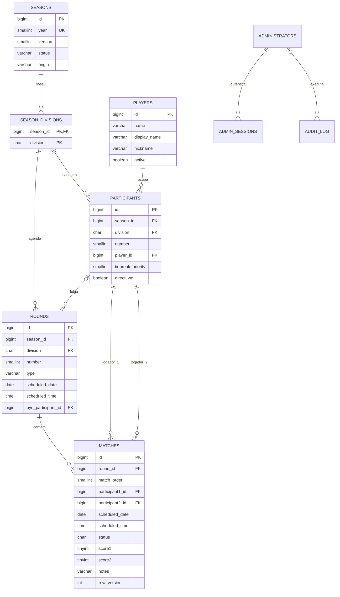

# Banco de dados

## Convenções

- MySQL/MariaDB, `utf8mb4_unicode_ci`.
- Horários persistidos em UTC para sessões/auditoria; datas esportivas são
  `DATE`/`TIME` sem conversão de fuso.
- IDs internos são `BIGINT UNSIGNED`.
- Divisões são `A` ou `B`.
- Status de temporada: `PREPARACAO`, `ATIVA`, `ARQUIVADA`.
- Status de partida: `A`, `V`, `E`.

## Modelo relacional

## Tabelas

### `settings`

Configurações chave/valor:

- `temporada_atual`: ano vigente;
- `ranking_reference_year`: último ano da janela do ranking, opcional;
- `taxa_inscricao_<ANO>`: taxa de cada temporada.

### `players`

Cadastro global. `name`, `display_name` e `nickname` têm funções distintas na
interface e nos materiais. `active` controla disponibilidade, não vínculo.

### `seasons`

Um registro por ano (`uq_seasons_year`). `version` existe para evolução e
controle, mas conflitos administrativos se apoiam principalmente em
`matches.row_version` e transações.

### `season_divisions`

Declara quais divisões existem no ano. Isso permite histórico sem Série B.

### `participants`

Vínculo jogador/temporada/divisão/número. A unicidade é por
`(season_id, division, number)`. O índice de jogador não é único para permitir
trocas administrativas; a regra de não duplicidade na temporada é validada na
aplicação.

- `tiebreak_priority`: menor número tem precedência.
- `direct_wo`: exclui pontos da participação no ranking e influencia desempate.

### `rounds`

Agenda comum da rodada e participante de folga. O tipo atual é `REGULAR`.

### `matches`

Confronto e agenda específica. `scheduled_date/time`, quando preenchidos,
sobrescrevem a rodada. `row_version` cresce a cada edição para evitar gravação
silenciosa sobre estado desatualizado.

### `administrators` e `admin_sessions`

O administrador é ligado ao subject/e-mail Google. Sessões guardam apenas hash
SHA-256 do token opaco, validade, último uso e revogação.

### `audit_log`

Registra ação, entidade, antes/depois em JSON, administrador, IP e user-agent.

### `data_versions`

Versão por escopo. O sistema usa `global` e incrementa após gravações.

### `schema_migrations`

Histórico das versões SQL aplicadas.

## Instalação e migrações

`001_initial_schema.sql` é um snapshot consolidado e já contém `scheduled_date`,
`scheduled_time`, índice não único de participante e `direct_wo`. Em banco novo,
importe somente 001.

Os arquivos 002–004 atualizam instalações antigas:

- 002 adiciona agenda por partida;
- 003 substitui a antiga unicidade de jogador por índice;
- 004 adiciona W.O. direto.

Antes de aplicar migração incremental:

1. faça backup;
2. consulte `schema_migrations`;
3. confira `information_schema.columns` e `statistics`;
4. aplique em QAS;
5. valide dados e só então produção.

Observação: 002 e 004 não são totalmente idempotentes; reaplicá-las quando a
coluna já existe gera erro.

## Integridade operacional

- Nunca editar IDs e FKs manualmente sem transação.
- Excluir temporada remove divisões, participantes, rodadas e partidas por
  cascata.
- Jogadores referenciados não devem ser apagados; inative-os.
- Mudanças de chaveamento devem preservar resultados quando os confrontos ainda
  correspondem e exigir confirmação quando houver risco.
- Toda alteração estrutural exige nova migração numerada e atualização deste
  documento.
