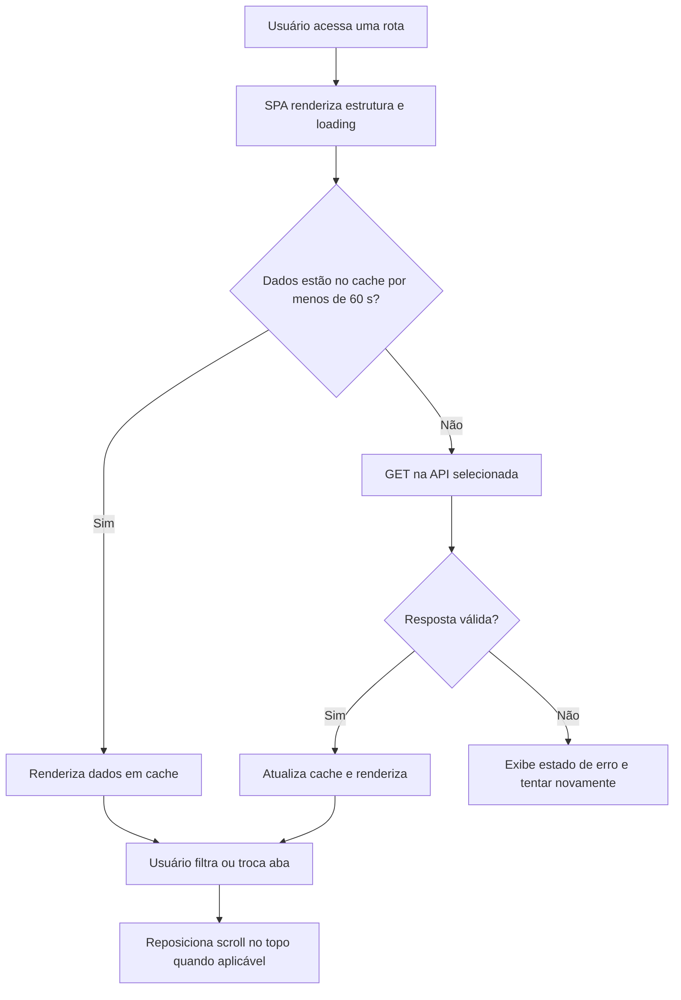
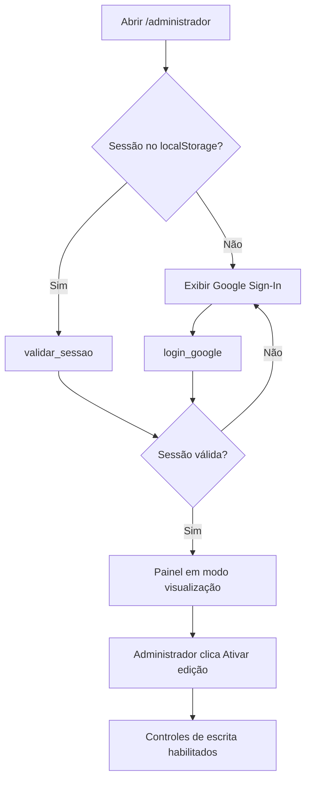
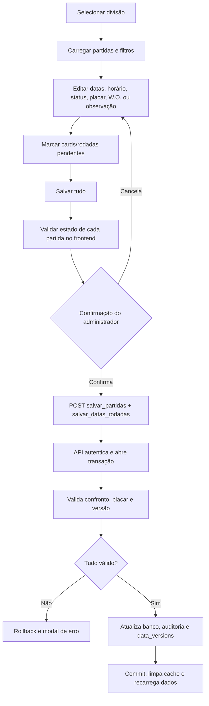
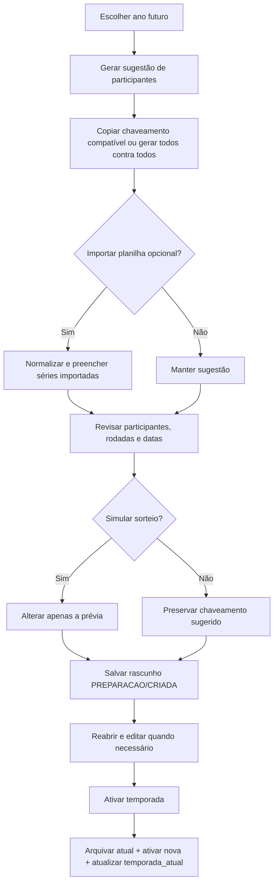
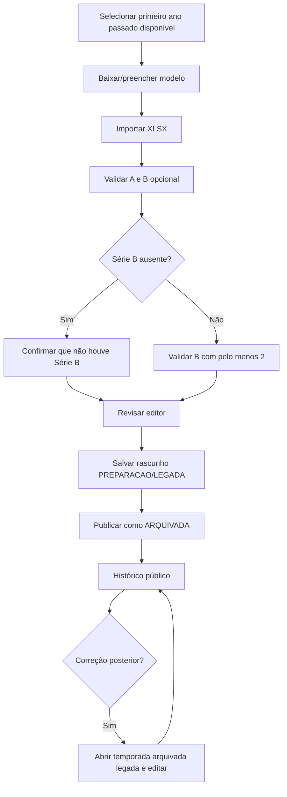
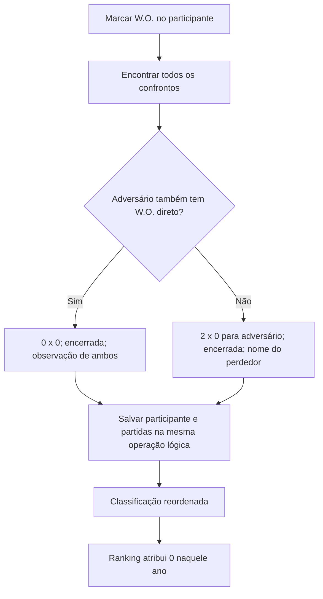
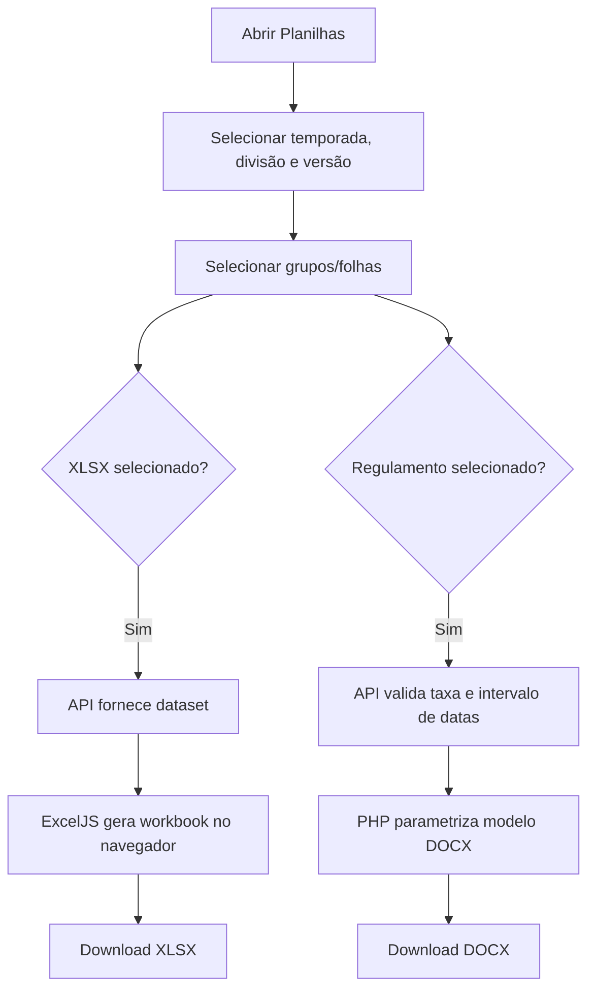
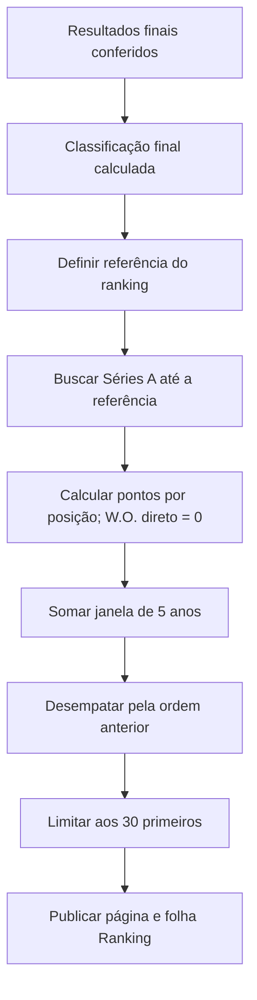

# Fluxos BPM

Os diagramas representam o comportamento desejado e os pontos de persistência.
Pendências técnicas conhecidas estão em `DECISOES_E_PENDENCIAS.md`.

## Consulta pública

## Login e entrada no modo edição

## Alterar partidas da temporada atual

## Cadastrar nova temporada

No PHP, a última transição é atômica e sofre rollback integral em qualquer erro.
No QAS, a mesma regra funcional é protegida por `ScriptLock`.

## Cadastrar ou corrigir temporada histórica

## W.O. direto

## Gerar arquivos

## Encerramento e ranking

