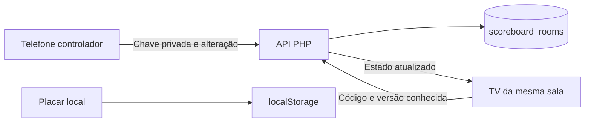

# Placar compartilhado por salas

## Estado em 27/08/2026

Etapa 1: usuário confirmou a criação da tabela 005 no servidor.
Etapa 2: API PHP implementada em `api/placar.php`, com migração adicional 006
para senha de transferência e limites de tentativas. Usuário confirmou status
online, salas habilitadas, MySQL e validade de 86400 segundos.
Etapa 3: interface integrada; aguardando envio e teste real entre aparelhos.
Testes automatizados do cliente passaram com transporte simulado; isso não
substitui validação das operações no MySQL real.

## Decisões confirmadas

- Salas exclusivamente em PHP/MySQL, inclusive na versão final.
- Exceção explícita à paridade com Apps Script; este não armazenará salas.
- Sem login administrativo ou cadastro de contas para usar o placar.
- Um controlador por sala e televisões somente para visualização.
- Outro aparelho pode assumir com a senha da sala: o token anterior é revogado
  atomicamente e a versão aumenta, preservando todos os pontos e nomes.
- Cada sala isolada, sem vínculo com partidas oficiais ou temporadas.
- Modo local preservado para uso sem TV ou internet.
- Atualização da TV sem recarregar a página, usando consultas curtas à API.



## Etapa 1 — banco

Aplicar `database/migrations/005_scoreboard_rooms.sql` no banco selecionado do
AEC Sinuca, após backup. A migração cria uma tabela independente, sem chaves
estrangeiras ou escritas em jogadores, partidas, temporadas e ranking.
Somente `schema_migrations` recebe o registro da nova versão.

Campos principais:

- `room_code`: código único de visualização; não autoriza alterações.
- `controller_token_hash`: apenas SHA-256 da chave privada, nunca a chave pura.
- `state_json`: estado auxiliar do placar, a ser validado pela API.
- `state_version`: versão crescente para detectar conflitos e atualizar a TV.
- `last_command_id` e `last_command_hash`: suporte ao reconhecimento do último
  comando repetido, com verificação do conteúdo. A API garante isso em transação
  e rejeita comandos com versões antigas.
- `expires_at` e `closed_at`: validade e encerramento da sala, em UTC.
- `created_at` e `updated_at`: datas operacionais da sala.

`IF NOT EXISTS` permite repetir a criação sem apagar dados, mas não corrige uma
tabela existente com estrutura divergente. Conferir `SHOW CREATE TABLE` antes
de considerar uma reaplicação concluída.

## Próximas etapas

1. Publicar `js/scoreboardRooms.js`, `js/pages/placar.js`,
   `css/components.css` e `service-worker.js` (cache v24), junto com a versão
   atualizada de `api/src/ScoreboardRoomService.php` (códigos/PIN numéricos).
2. Criar sala no telefone, abrir código/link em outra tela e conferir pontos.
3. Assumir controle em outro telefone com a senha; confirmar bloqueio do anterior.
4. Testar reconexão, isolamento de duas salas e preservação do placar local.

Não colocar a chave de controle em links públicos, logs ou respostas de leitura.
O código de visualização não é autenticação pessoal: qualquer pessoa com ele
poderá acompanhar os nomes e pontos da sala enquanto estiver válida.

## Pontos a fechar antes da integração

- Prazo padrão de 24 horas renovado por atualização ou transferência; ajustável
  por `ttl_seconds` de 1 hora a 7 dias. Confirmar se o padrão atende ao salão.
- Intervalo de consulta da TV e recuo após falhas, medidos na hospedagem.
- Registros de salas numéricas expiradas são substituídos quando seu código
  é reutilizado. Limpeza física de códigos legados e buckets de limite segue
  pendente; o limite de códigos não elimina essa necessidade operacional.

## Etapa 2 — API exclusiva do MySQL

Endpoint separado: `/sinuca-aec/api/placar.php`. Não passa por `AdminService`,
não grava `matches`, não usa sessão Google e não incrementa `data_versions`.
Fica desabilitado por padrão até configurar `scoreboard_rooms.enabled = true`.
O `api/index.php` existente não mudou.

Migração 006 adiciona `control_password_hash` (hash via `password_hash`) e
`scoreboard_rate_limits`. Senha não é o token: senha permite assumir; token
aleatório de 32 bytes identifica o controlador atual. Somente seu SHA-256 é
guardado. A coluna de senha é nullable para compatibilidade com eventual sala
anterior, mas toda sala criada pela nova API recebe hash; sala antiga sem hash
não pode transferir controle.

### Transporte e ações

- `GET ?acao=status`: saúde/leitura do schema, sem criação de sala.
- Todas as outras ações usam `POST`, `Content-Type: application/json`, corpo
  máximo de 128 KiB, mesma origem e respostas `Cache-Control: no-store`.
- Senhas e tokens não são aceitos pela query string. A API não retorna detalhes
  SQL nem segredos em erros, mesmo com debug ativo.

| `acao` | Campos | Resposta adicional |
|---|---|---|
| `criar` | `senha`, `estado` | `controller_token`, `controle_ativo: true` |
| `consultar` | `codigo`, `versao?`, `controller_token?` | `alterado`, `controle_ativo` se token informado |
| `assumir_controle` | `codigo`, `senha` | novo `controller_token`, `controle_ativo: true` |
| `atualizar` | `codigo`, `controller_token`, `versao`, `comando_id`, `estado` | `repetido` |
| `encerrar` | `codigo`, `controller_token`, `versao`, `comando_id` | `repetido` |

Resposta de sala: `codigo`, `versao`, `estado`, `expira_em` (ISO UTC),
`encerrada`. Na consulta sem mudança de versão, `estado` é omitido. A consulta
pública nunca devolve senha, hash ou token. Um token antigo pode consultar e
receber `controle_ativo: false`, mas qualquer escrita com ele é recusada (403).

`estado` tem exatamente os dados auxiliares atuais: `names` (dois nomes de
1–40 caracteres), `points` (dois inteiros 0–999999), `wins` (0–9999),
`breakPlayer` (0 ou 1), `strokeScore` (0–999999), `history` (até 500 partidas),
`firstStarter` (null: não definido; 0/1: quem saiu na primeira partida).
Estados antigos sem `firstStarter` são aceitos como null. Não exige migração SQL.
Cada partida do histórico tem `date` (ISO UTC com milissegundos), `points` e
`winner` (0 ou 1), coerente com o maior placar. Campos não reconhecidos são
descartados. A interface deve escapar nomes ao renderizar.

`comando_id` é UUID e deve permanecer igual ao repetir a MESMA requisição após
falha de rede, com a MESMA versão e conteúdo. O controlador deve serializar
escritas: aguardar confirmação antes de enviar a próxima. Repetição imediata
devolve o resultado sem incrementar versão/pontos. Repetição mais antiga é
recusada pela versão. Após 409, consultar e reconciliar, nunca reenviar um
snapshot desatualizado com uma versão nova sem decisão explícita.

Criação não tem repetição automática: resposta perdida pode deixar sala órfã
até expirar. Transferência pode ser repetida mediante senha, mas cada sucesso
rotaciona a chave; não fazer tentativas concorrentes de assumir controle.

### Segurança e operação

- `UPDATE` e troca de controle usam transação e `SELECT ... FOR UPDATE`.
- Senha: exatamente quatro dígitos ASCII, incluindo zeros iniciais (ex.: `0123`).
- Novas salas: seis dígitos entre `000001` e `999999`, mantidos como string.
  `000000` é inválido. Inputs usam teclado numérico sem converter para número.
  Links legados de 12 caracteres ainda podem consultar/controlar com token até
  expirar; senhas legadas longas não atendem ao novo formato de transferência.
- Limites de janela fixa: 1200 requisições/minuto/IP; 5 criações/hora/IP e
  100/hora globais; 10 transferências/15 minutos/IP, 30/15 minutos/sala e
  300/15 minutos globais. PIN tem somente 10 mil combinações: limites são
  essenciais, e ele não equivale à segurança de uma senha longa.
- Falhas de senha contam no limite, independentemente do rollback da sala.
- IP usa `REMOTE_ADDR`, não cabeçalho enviado pelo cliente. Em proxy/CDN,
  conferir se todos os clientes compartilham esse endereço antes de ajustar.
- HTTP 400: entrada inválida; 403: senha/token inválido; 404: sala inexistente;
  409: conflito/reutilização de comando; 410: encerrada/expirada; 429: limite.
- Sala encerrada ainda pode ser consultada até expirar; consulta não renova
  validade. Não há heartbeat nem indicador de presença implementado ainda.
- O token é autorização por posse, não identidade de dispositivo. Não copie
  o token entre aparelhos; a transferência com senha é o fluxo suportado.
- Interface não usa login Google nem o seletor de backend do campeonato.

## Etapa 3 — interface e recuperação

- `/placar`: barra compacta Criar sala / Entrar em sala. Criar copia o placar
  local atual, sem apagá-lo; nomes vazios recebem Jogador 1 e Jogador 2.
- `/placar/tv?sala=CODIGO`: visualizador, sem comandos de pontuação pelo teclado.
  Sem legenda nem modal de atalhos por `/`; logo não navega e o botão de voltar
  ao topo fica oculto. Só os controles de sala e seus modais são interativos.
  No modo TV (local e sala), indicador de tacada usa 80% da fonte dos nomes;
  identificadores centrais e o × das partidas são maiores, sem mudar os números.
  Sem `sala`, a TV mantém as teclas e o funcionamento local anteriores.
- Link da TV mostra código e URL selecionáveis para copiar. Nunca contém senha
  ou token. No telefone, o espectador pode usar Assumir controle com a senha.
- Senha não é persistida. Token e comando pendente ficam em `sessionStorage`
  por código; sobrevivem à recarga da aba, mas não há garantia após fechá-la.
  Para recuperar o controle em outro aparelho ou sessão, usar a senha.
- Consultas a cada 2 segundos, após terminar a anterior, com recuo até 30s
  após falhas (60s em limite 429). Não há presença de TV confirmada: “conectado”
  significa comunicação com a API, não necessariamente outro aparelho online.
- Uma escrita por vez. Pontos exibidos são os confirmados pelo servidor;
  enquanto aguarda, os controles ficam desabilitados. Falha incerta conserva
  UUID, versão e conteúdo e tenta novamente, inclusive após recarga.
- Conflito descarta a intenção antiga e consulta o estado atual; não faz merge
  automático. Token revogado torna o telefone somente espectador.
- Sair da sala restaura o placar local; não encerra a sala nem apaga dados.
  A saída fica bloqueada enquanto há comando pendente. A sala expira conforme
  a API; nesta etapa não há botão de encerramento definitivo da sala.
- Criar/assumir não têm repetição automática. Resposta perdida pode exigir nova
  tentativa manual; a transferência seguinte revoga a chave anterior.
- Nenhuma operação da sala grava partidas oficiais, ranking ou temporadas.

## Códigos reutilizáveis e desfazer

### Saída alternada

Em `/placar`, abaixo da sala, “Quem saiu primeiro?” usa os nomes atuais.
Padrão Não definido preserva a tacada existente e oculta os indicadores.
Quando definido, saída = (firstStarter + soma das partidas vencidas) módulo 2.
Finalizar uma partida inicia a tacada do próximo a sair, independente do vencedor.
Trocas de tacada/faltas e reinício somente dos pontos não alternam a saída.
Limpar o jogo mantém a escolha e retorna à primeira saída; desfazer restaura o
snapshot anterior. Alterar a escolha durante pontos em andamento só corrige a
saída indicada, sem interromper a tacada; com pontos/tacada zerados, aplica-a já.
Celular mostra bola branca e SAÍDA abaixo do nome; a seta de tacada ocupa a
mesma linha do nome, sem ser centralizada junto ao indicador SAÍDA. TV mostra SAÍDA acima de
Tacada com apenas a seta voltada ao jogador correspondente. Tudo acompanha a
sala e transferência de controle. Só o controlador pode alterar a seleção.
Publicar também `js/scoreboardOpening.js`, `api/src/ScoreboardState.php` e
`assets/images/regulamento/BallIcon.svg`, além do placar, CSS e service worker.

O gerador tenta códigos aleatórios; colisão com sala ativa nunca a sobrescreve.
Colisão com sala expirada substitui atomicamente estado, senha e token, limpa
o último comando e incrementa a versão (não volta para 1). Próximo da lotação,
uma busca por código expirado ou lacuna evita falhar apenas por azar no sorteio.
São até 999999 códigos numéricos ocupáveis, não um limite vitalício de criações.
O UPDATE condicional garante que apenas uma criação concorrente reivindique
o mesmo código expirado. A senha verificada antes de assumir controle é
conferida novamente sob lock para impedir a corrida com reutilização.
Tokens antigos são inválidos; um link público antigo pode mostrar a NOVA sala
se seu código for reutilizado. Portanto, o código não é um identificador eterno.

`Desfazer última ação` em `/placar` restaura um estado por clique (até 100),
incluindo pontos, tacada, nomes, partidas e histórico. Não é um botão de redo.
Localmente a pilha vale durante a sessão da página; na sala, fica no
sessionStorage do controlador e sobrevive à recarga. Não é transferida ao
novo árbitro: transferência/conflito invalidam o histórico antigo por segurança.
Cada reversão é uma escrita versionada, confirmada pela API e sincronizada com
a TV; falha de rede repete o mesmo comando e não consome duas reversões.
O botão fica desabilitado sem histórico, sem controle ou aguardando confirmação.
Backspace do modo TV local permanece como antes; TV em sala é somente leitura.

## Validação da primeira etapa

No phpMyAdmin, com o banco correto selecionado:

```sql
SHOW CREATE TABLE scoreboard_rooms;
SELECT version FROM schema_migrations WHERE version = '005_scoreboard_rooms';
SELECT COUNT(*) AS total_salas FROM scoreboard_rooms;
```

Em uma instalação nova desta etapa, a contagem deve ser zero. Não há necessidade
de cadastrar salas manualmente. A estrutura ainda não foi validada contra um
MySQL real pelo agente; essa confirmação integra o teste no servidor.
